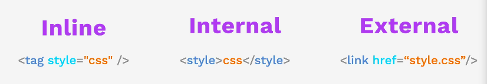

## Introduction to CSS

#### CSS can be inserted by 3 different ways:


### 1º Inline
```
<body>
  <h1 style="color: blue">Style Me in Blue!</h1>
</body>
```
### 2º Internal

```
<head>
  <meta charset="UTF-8">
  <title>Internal</title>
  <style>
    h1 {
      color: red;
    }
  </style>
</head>
```
### 3º External
```
<head>
  <meta charset="UTF-8">
  <title>External</title>
  <link rel="stylesheet" href="./style.css">
</head>
```
