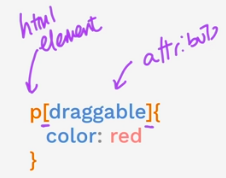

## CSS Selectors

### 1º) Class Selector

index.html
```
<h2 class="red-text">Red</h2>
<h2>Green</h2>
<h2>Blue</h2>
```
styles.css
```
.red-text{
    color:red;
}
```

### 2º) ID Selector
index.html
```
<h2 id="main">Red</h2>
<h2>Green</h2>
<h2>Blue</h2>
```

styles.css
```
#main{
    color:red;
}
```
-----
### Class: many elements

### ID: only one element
-----

### 3º) Attribute Selector



index.html
```
<p draggable="true">Drag me</p>
<p>Don't drag me</p>
<p draggable="false">Don't drag me</p>
```

styles.css
```
p[draggable]{
    color:red;
}
```

### 4º) Universal Selector

index.html
```
<h1 class="title">Hello</h1>
<h2 id="heading>World</h2>
<p draggable="true">This is a website</p>
```

styles.css
```
*{
    color:red;
}
```